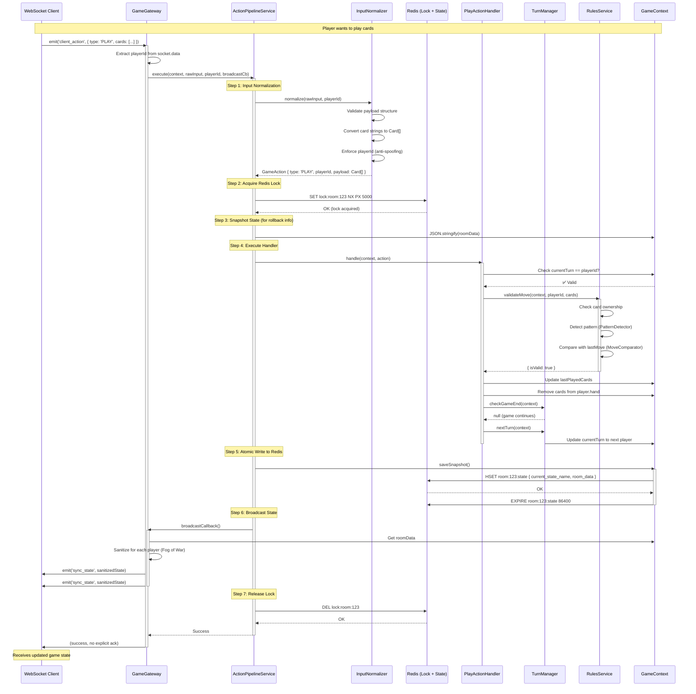
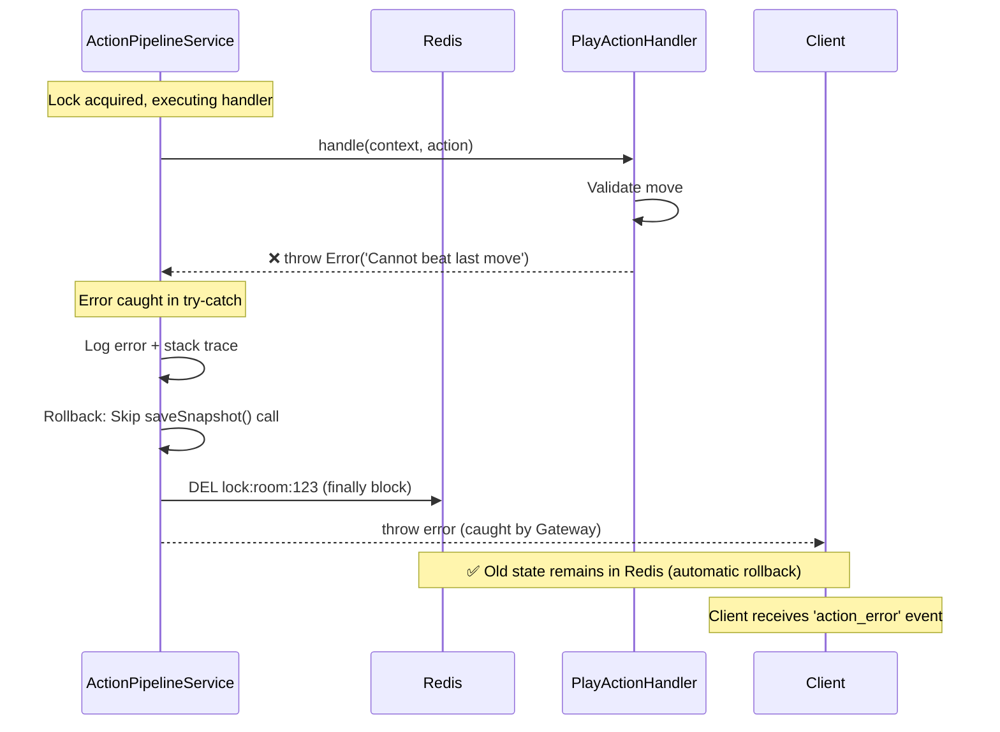
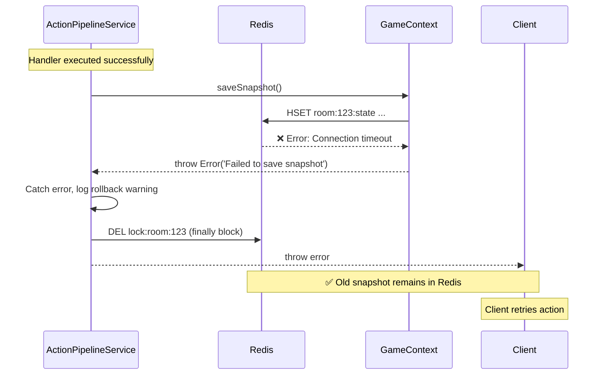
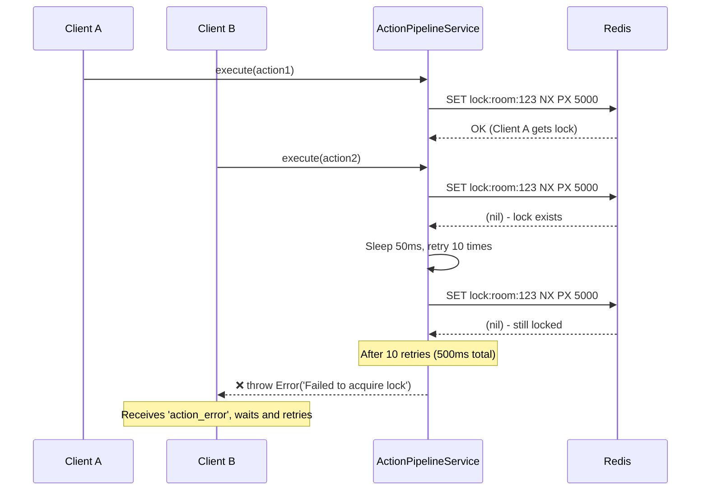

# Phase 18.3: Action Pipeline Integration - QA Handoff

## Overview
This document describes the complete E2E flow for processing player actions through the Action Pipeline, including Redis persistence, distributed locking, and error handling strategies.

---

## E2E Integration Test: Complete Action Flow

### Sequence Diagram



---

## Error Scenarios & Rollback Strategy

### Scenario 1: Handler Validation Fails (Invalid Move)



**Rollback Behavior:**
- ❌ `context.roomData` is modified in memory (corrupted)
- ✅ `saveSnapshot()` is never called → Redis keeps old valid state
- ✅ Next action will reload from Redis, discarding corrupted memory state

---

### Scenario 2: Redis Write Fails (Network/Disk Issue)



**Rollback Behavior:**
- ✅ Old state remains in Redis (write never committed)
- ✅ Client can retry the same action
- ❌ If retry succeeds, player may need to re-submit cards (client handles duplicate detection)

---

### Scenario 3: Lock Acquisition Fails (High Concurrency)



**Fallback Behavior:**
- ✅ Prevents concurrent modifications (data consistency guaranteed)
- ✅ Client receives clear error message
- ✅ Client can retry after short delay

---

## Testing Checklist

### Unit Tests
- [ ] `InputNormalizer` - Card string conversion, payload validation
- [ ] `PlayActionHandler` - Turn validation, card removal logic
- [ ] `PassActionHandler` - Free turn rejection
- [ ] `ActionPipelineService` - Lock acquisition/release, error handling

### Integration Tests
- [ ] **Test 1: Successful PLAY action**
  - Send valid PLAY action
  - Verify Redis lock acquired/released
  - Verify state updated in Redis
  - Verify broadcast triggered
  - Verify client receives `sync_state`

- [ ] **Test 2: Invalid move rejection**
  - Send PLAY with cards that don't beat last move
  - Verify handler throws error
  - Verify state NOT saved to Redis
  - Verify lock released
  - Verify client receives `action_error`

- [ ] **Test 3: Concurrent action handling**
  - Send 2 actions simultaneously from different clients
  - Verify only one acquires lock
  - Verify second action waits and retries
  - Verify both eventually succeed (if valid)

- [ ] **Test 4: Redis connection failure**
  - Simulate Redis disconnect during `saveSnapshot()`
  - Verify error is caught
  - Verify lock released
  - Verify client can retry

### E2E Test Script

```bash
cd backend
npx ts-node scripts/test-action-pipeline.ts
```

The script should:
1. Connect 2 clients to same room
2. Client A plays cards
3. Verify Client B receives update with hidden cards
4. Client B passes
5. Verify turn advances
6. Client A tries to pass on free turn → should fail
7. Verify rollback (state unchanged)

---

## Rollback Strategy Summary

| Failure Point | State in Redis | State in Memory | Client Impact | Auto-Rollback? |
|---------------|----------------|-----------------|---------------|----------------|
| Input Normalization | ✅ Unchanged | ✅ Unchanged | Receives `action_error` | ✅ Yes (nothing modified) |
| Lock Acquisition | ✅ Unchanged | ✅ Unchanged | Receives `action_error` + retry | ✅ Yes |
| Handler Validation | ✅ Unchanged | ❌ Corrupted | Receives `action_error` | ✅ Yes (not persisted) |
| Redis Write | ✅ Unchanged | ❌ Corrupted | Receives `action_error` + retry | ✅ Yes (write failed) |
| Broadcast Failure | ✅ Updated | ✅ Updated | Partial clients notified | ⚠️ Eventually consistent |

**Key Insight:**
- Redis is the **source of truth**
- If `saveSnapshot()` fails, Redis keeps old state → automatic rollback
- If handler corrupts memory but doesn't persist, next action reloads from Redis
- Distributed locks prevent concurrent corruption

---

## Performance Metrics (Expected)

| Metric | Target | Notes |
|--------|--------|-------|
| Lock acquisition time | < 5ms | Average, no contention |
| Lock retry delay | 50ms | Per retry attempt |
| Max lock holding time | < 100ms | Handler + Redis write |
| Redis write latency | < 10ms | Local Redis |
| Pipeline total latency | < 150ms | End-to-end action processing |
| Concurrency support | 100 req/s per room | With lock retries |

---

## Error Codes for Clients

| Code | HTTP Equivalent | Description | Client Should |
|------|-----------------|-------------| --------------|
| `ACTION_FAILED` | 400 | Handler validation failed | Display error message |
| `LOCK_TIMEOUT` | 503 | Failed to acquire lock | Retry after 200ms |
| `INVALID_INPUT` | 400 | Normalization failed | Fix payload format |
| `NOT_YOUR_TURN` | 403 | Turn validation failed | Wait for turn |
| `INVALID_MOVE` | 400 | Rules violation | Choose different cards |

---

## Next Steps

1. **Implement E2E Test Script**: `scripts/test-action-pipeline.ts`
2. **Performance Testing**: Use `artillery` to load test concurrent actions
3. **Monitoring**: Add metrics for lock contention, Redis latency
4. **Optimization**: Consider Redis pipelining for batch reads/writes

---

**Document Version**: 1.0  
**Last Updated**: 2025-11-29  
**Status**: ✅ Ready for QA Testing
